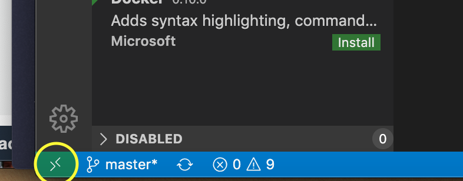
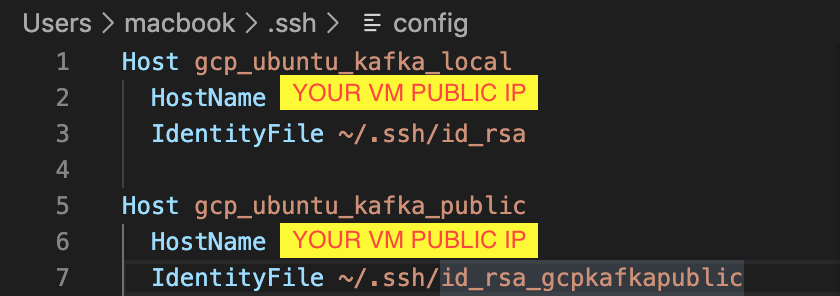
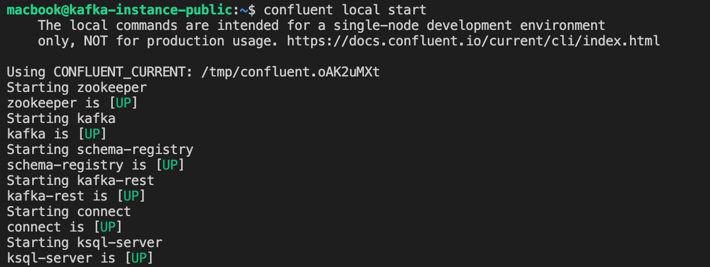

# Prerequisites

1. A laptop or a PC (better with a Linux or Mac OS)

2. Cloud Provider Account (the step bellow will be using GCP)
    - Create VM
    - Add local SSH key to VM

3. Editor & Remote SSH (VSCode)
    - SSH to VM
    - Install SDK Man
    - Install Java from SDK Man
    - Install Maven from SDK Man
    - Install Confluent (Community Edition)
    - Install MySQL
    - Run BFI_API
    - Run BFI_Engine1
    - Run BFI_Engine2

## Step by step

### Create and Connect to VM

1. Go to **Compute Engine** and **Create Instance**

2. Modify the configuration for the vm
    - **Region**
        - asia-southeast1 (Singapore)
    - **Machine configuration**
        - General-purpose
            - E2 Series
            - e2-standard-2 (2 vCPU, 8 GB memory)
    - **Boot disk**
        - Public images
            - OS: Ubuntu
            - Ver: Ubuntu 16.04 LTS
    - **Firewall**
        - Allow both traffics
    - **Security**
        - SSH Keys
            - Insert your public ssh key to the VM (e.g : id_rsa.**pub**)
    - **Disks**
        - Additional disks
            - Add new disk and click **Done**

3. Click **Create** if you done with the configuration

4. Open VSCode, (and make user you have SSH Remote Extention installed first)

5. Open remote host window

And choose **Remote-SSH: Connect to Host...** after that choose **Configure SSH Host...**

6. Configure it like this

Try connect to the host that you already configure

### Installing the packages

1. Installing [SDK Man](https://sdkman.io/install)
    - First you need to install unzip zip package form apt-get
        - > sudo apt-get update
        - > sudo apt-get install unzip zip
    - Now install SDK Man
        - > curl -s "<https://get.sdkman.io>" | bash
        - > source "$HOME/.sdkman/bin/sdkman-init.sh"
    - Check if it's installed
        - > sdk version

2. Installing Java
    - > sdk install java 8.0.242.hs-adpt

3. Installing Maven
    - > sdk install maven

4. Installing [Confluent (Community Edition)](https://docs.confluent.io/current/installation/installing_cp/deb-ubuntu.html#systemd-ubuntu-debian-install)
    - > wget -qO - <https://packages.confluent.io/deb/5.4/archive.key> | sudo apt-key add -
    - > sudo add-apt-repository "deb [arch=amd64] <https://packages.confluent.io/deb/5.4> stable main"
    - > sudo apt-get update && sudo apt-get install confluent-community-2.12
    - For the Confluent CLI
        - > curl -L <https://cnfl.io/cli> | sh -s -- -b /usr/local/bin
    - Start the local confluent
        - > confluent local start
        - It'll show the engine were starting 

### Run the Apps

1. BFI API

    [Link to Repo](https://github.com/yyoel/bfi_api)

2. BFI Engine 1

    [Link to Repo](https://github.com/yyoel/bfi_engine1)

3. BFI Engine 2

    [Link to Repo](https://github.com/yyoel/bfi_engine2)

4. To run the apps start by doing
    - > mvn package
    - > java -jar /target/*.jar
